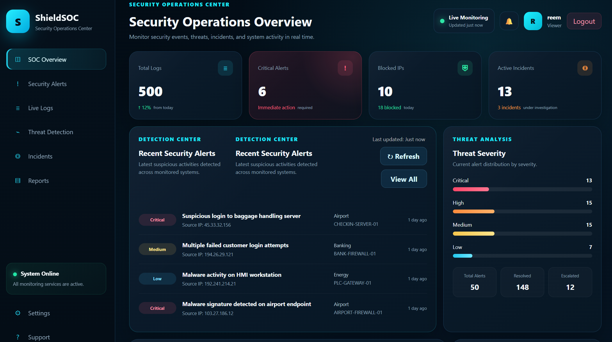

# ShieldSOC Dashboard

ShieldSOC is a Security Operations Center (SOC) dashboard developed using Python, Flask, SQLite, HTML, CSS, and JavaScript. The project simulates real-time security monitoring, incident response, threat detection, and user management through an interactive dashboard.

---

## Project Screenshots

### Security Operations Overview



### Live Monitoring


---

## Features

- Secure Login Authentication
- Role-Based Access Control (Administrator, SOC Analyst, Viewer)
- Real-Time Security Dashboard
- Live Security Logs Monitoring
- Threat Detection and Analysis
- Incident Management
- User Management
- Assign Security Alerts to Analysts
- Resolve Security Events
- Search and Filter Logs
- Export Security Logs
- Dashboard Auto Refresh
- Notifications Panel
- Blocked IP Monitoring
- Activity Audit Logging

---

## Technologies Used

- Python
- Flask
- SQLite
- HTML5
- CSS3
- JavaScript

---

## User Roles

### Administrator
- Manage users
- Create new accounts
- Delete users
- Access all dashboard features

### SOC Analyst
- Review security alerts
- Assign incidents
- Resolve security logs
- Monitor threats

### Viewer
- View dashboard
- Read security logs
- Monitor alerts

---

## Project Structure

```text
SOC-Dashboard/
│
├── backend/
│   └── app.py
│
├── frontend/
│   ├── index.html
│   ├── login.html
│   ├── style.css
│   ├── script.js
│   └── login.js
│
├── database/
│   ├── create_admin.py
│   ├── init_db.py
│   ├── seed_data.py
│   ├── add_assigned_analyst.py
│   └── shieldsoc.db
│
├── requirements.txt
│
└── README.md
```

---

## How to Run

1. Install Python
2. Install project dependencies:

```bash
pip install -r requirements.txt
```

3. Run the application:

```bash
python backend/app.py
```

4. Open your browser:

```
http://127.0.0.1:5000
```

---

## Author

**Salma Alqahtani**

Cybersecurity Graduate
